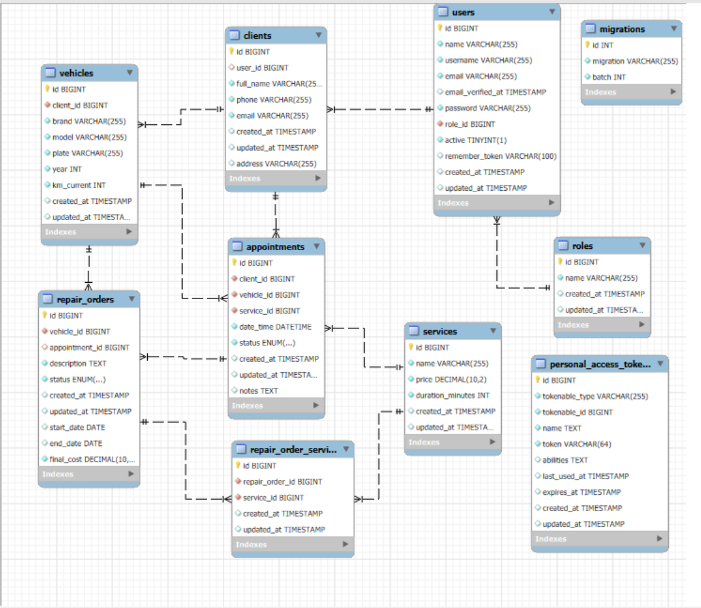

# Workshop Management System

Sistema de gestió per a tallers mecànics desenvolupat amb Laravel + React.

## Vídeo Demostració

[Enllaç al vídeo de demostració](https://drive.google.com/file/d/1YmC3of7amddi3r7miWbsmzPmfqMEQ5iS/view?usp=sharing)

---

## Funcionalitats

### Autenticació i Rols
- Sistema de login/register
- Dos tipus d'usuaris: **admin** i **user**
- Autenticació basada en tokens (Sanctum)

### Gestió de Dades (CRUD)
- **Clients**: Gestió de clients del taller
- **Vehicles**: Vehicles associats a clients
- **Services**: Catàleg de serveis disponibles
- **Appointments**: Cites prèvies per a serveis
- **Repair Orders**: Ordres de reparació amb serveis associats

### Panell de Control (Dashboard)
- Estadístiques generals per a administradors
- Vista de cites per a usuaris regulars
- Paginació (10 resultats per pàgina)
- Filtres de cerca per a cada secció

### Permisos
- **Admin**: Accés complet a totes les funcionalitats
- **User**: Accés limitat a appointments, vehicles i serveis

## Estructura del Projecte

```
├── backend/          # API Laravel
├── frontend/         # Aplicació React
└── README.md         # Aquest fitxer
```

## Instal·lació Completa

### Pas 1: Configurar Backend
```bash
cd backend
composer install
cp .env.example .env
```

Crear la base de dades **workshop** a MySQL (via Workbench):
```sql
CREATE DATABASE workshop;
```

Editar el fitxer `.env` i configurar les línies següents amb les teves credencials de MySQL:
```
DB_CONNECTION=mysql
DB_HOST=127.0.0.1
DB_PORT=3306
DB_DATABASE=workshop
DB_USERNAME=root       # El teu usuari de MySQL
DB_PASSWORD=           # La teva contrasenya (deixar buit si no tens)
```

Executar migracions i seeders (això crearà les taules i dades de prova automàticament):
```bash
php artisan key:generate
php artisan migrate:fresh --seed
php artisan serve
```


### Pas 2: Configurar Frontend
En un nou terminal:
```bash
cd frontend
npm install
npm run dev
```


### Pas 3: Accedir a l'Aplicació
**Usuari Admin** (creat automàticament pel seeder):
- Email: `admin@workshop.com`
- Password: `password`

O pots registrar un usuari nou (per defecte serà **user** amb accés limitat).

**Nota:** El seeder també crea dades de prova (serveis, clients, vehicles, cites) per poder provar l'aplicació immediatament.

## Esquema de Base de Dades



### Taules del Sistema
- `personal_access_tokens` - Tokens d'autenticació Sanctum
- `migrations` - Control de versions de la BD


## Característiques

- Validació de dades al backend i frontend
- Gestió d'errors amb notificacions visuals
- Paginació amb botons Previous/Next
- Filtres de cerca per a cada secció
